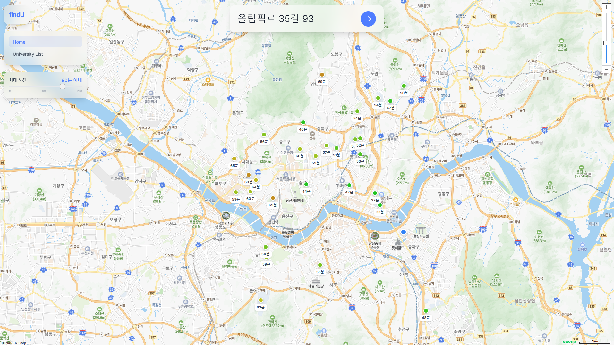

# findU

[](https://github.com/jaewonzzang/findU/actions/workflows/ci.yml)

집 주소 하나로, 수도권 38개 대학까지의 실제 통학 시간을 계산해 가까운 순으로 보여주는 웹 앱.

**Live**: https://find-u-iota.vercel.app/

## 주요 화면



## 문제 & 해결

수험생이 대학을 고를 때 "우리 집에서 통학 가능한가"는 중요한 기준이지만, 대학마다 지도 앱을 열어 일일이 길찾기를 돌려봐야 알 수 있다. findU는 집 주소를 한 번 입력하면 수도권 주요 대학 38곳(분캠 포함)까지의 통학 시간을 한 번에 계산해 정렬된 목록과 지도로 보여준다.

동작 방식: 입력한 주소를 Naver Geocoding API로 좌표로 변환하고, 각 대학까지의 소요 시간을 Naver Directions 5 API로 병렬 계산한 뒤, 사용자가 설정한 최대 통학 시간으로 필터링해 가까운 순으로 정렬한다.

## 기술 스택

**Backend**
- Python / FastAPI / Pydantic
- httpx (비동기 외부 API 호출)
- Starlette SessionMiddleware + itsdangerous (세션 쿠키 서명)

**Frontend**
- React 18 / TypeScript / Vite
- Tailwind CSS / React Router v7 / Framer Motion
- Naver Maps JavaScript SDK (지도 렌더링)

**외부 API**
- Naver Cloud Platform: Geocoding, Directions 5
- Kakao: 로컬 키워드 검색(주소 자동완성), OAuth 로그인

별도 데이터베이스는 사용하지 않는다. 대학 목록은 정적 데이터, 통근 시간은 인메모리 캐시로 처리한다(아래 구현 결정 참고).

## 아키텍처

```
주소 입력 (자동완성: Kakao 키워드 검색 프록시)
   │
   ▼
POST /api/commute
   │
   ├─ Naver Geocoding: 주소 → 좌표
   ├─ 주간 캐시 조회 (좌표 110m 격자 + 대학 + 교통수단 키)
   ├─ 캐시 미스분만 Naver Directions 5 병렬 호출 (asyncio.gather)
   │    └─ 대중교통 모드: 차량 시간 × 1.3 + 15분으로 추산
   ▼
최대 통학시간 필터 → 시간순 정렬 → 프론트에서 지도 마커 + 애니메이션 리스트 렌더링
```

- API 키가 없거나 외부 API가 실패하면 추정치로 폴백하고, 결과에 `is_fallback` 플래그를 붙여 실측/추정을 구분한다. 반면 주소 매칭 결과가 0건인 경우(사용자 입력 오류)는 폴백하지 않고 404와 안내 메시지를 반환한다.
- Kakao OAuth 로그인은 세션 쿠키 기반이며, state 파라미터로 CSRF를 방어한다.

**배포**: 프론트엔드는 Vercel, 백엔드는 Railway에 배포되어 있다.

## 핵심 구현 결정

**1. DB 대신 주간 인메모리 캐시** (`backend/commute_cache.py`)

한 번의 검색이 대학 38곳에 대한 Directions API 호출 38건을 발생시킨다. API 쿼터를 아끼기 위해 (출발 좌표, 대학, 교통수단) 단위로 결과를 캐싱하되, 좌표를 소수점 3자리(약 110m 격자)로 반올림해 근처 주소끼리 캐시를 공유하게 했다. 통학 시간은 교통 패턴에 따라 변하므로 캐시는 매주 월요일 자정(KST)에 전체 초기화된다. 프로토타입 규모에서 DB를 붙이는 것은 과했고, 프로세스 재시작 시 캐시가 날아가는 비용은 감수할 만하다고 판단했다.

**2. 대중교통 시간은 차량 기준 추산** (`backend/naver_client.py`)

Naver Cloud Platform에 공개 대중교통 길찾기 API가 없다. 대중교통 모드를 빼는 대신, 차량 소요 시간 × 1.3 + 15분이라는 보수적 추산식을 쓰고 결과 요약에 "차량 기준 추산"임을 명시했다. 정확도를 일부 포기하는 대신 사용자에게 추정치임을 투명하게 알리는 쪽을 택했다.

## 실행 방법

### Backend (FastAPI)

```bash
cd backend
pip install -r requirements.txt
uvicorn main:app --reload   # http://localhost:8000
```

환경 변수: `backend/.env.example` 참고. Kakao OAuth 설정 절차는 `docs/kakao-oauth-setup.md`.

테스트:

```bash
cd backend
pip install -r requirements-dev.txt
pytest tests
```

캐시 격자 공유/주간 초기화, 대중교통 추산식, `/api/commute` 성공·폴백·주소없음(404) 경로를 커버한다. 백엔드 테스트와 프론트엔드 빌드는 GitHub Actions CI로 매 push마다 검증된다.

### Frontend (React + Vite)

```bash
cd frontend
npm install
npm run dev     # http://localhost:5173
npm run build
```

환경 변수: `VITE_NAVER_MAP_CLIENT_ID` (Naver Maps JS SDK)
